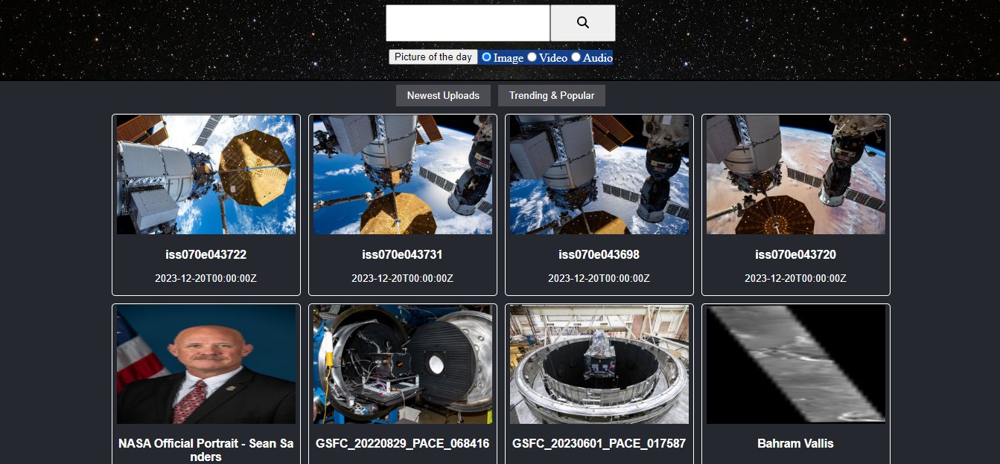
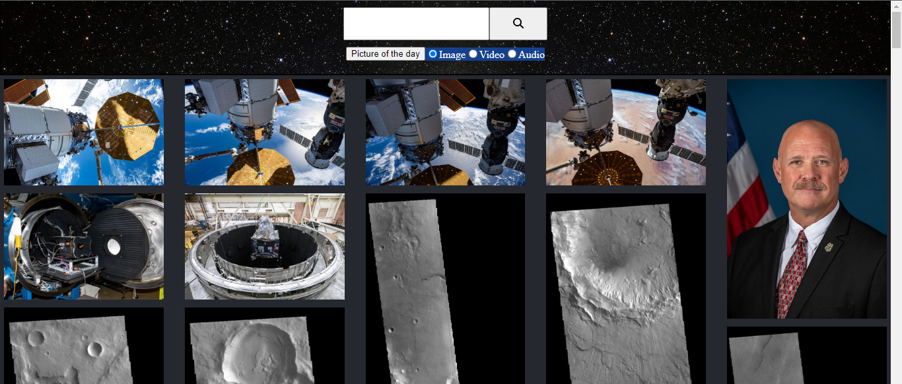
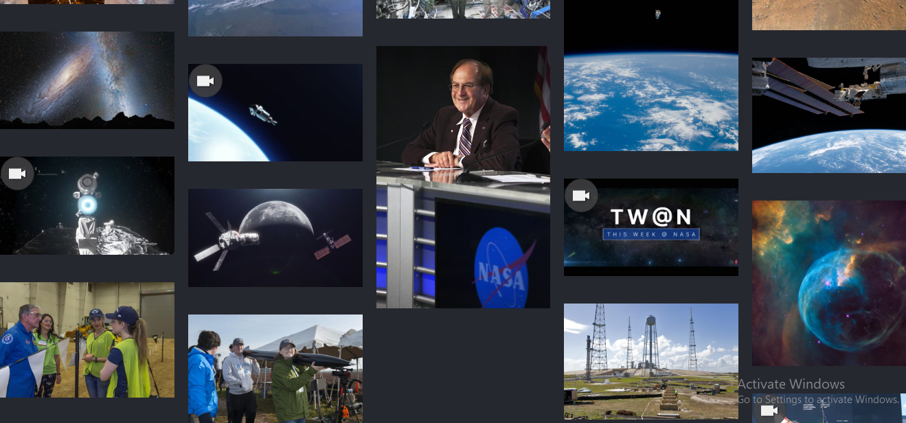

# Version 1

1. Basic view of Trending and latest news, based on Nasa API all the Images are clickable and presented in a card Format
2. Each card is clicable and renders CardModal Component which display the information of respective card clicked using react-modal
3. Header contains input with search button which works and render the searched data on a homepage and APOD (Astronomical Picture of the day) 
4. Very basic styling with no color added except for border 
5. Added logs and Instruction on how one can use the site 
6. Basic project folder structure where component folder represents the files that are used to render the elements of an entire page 
7. Container folder represents reusable components 

# Version 1.1

1. Packages installed react-spring, react-router, react-router-dom, react-use-measure, lodash.shuffle
2. Added Routing currently only 3 pages are added /, test, *
3. Added styling to header by adding background Image
4. Added asset folder to use default images this images are generated using Bing chat
5. Test folder is created to test and implement new ways to render HomePage

# Version 1.2

1. Added Mosaic/ Masonry layout in the home page it resolves stretching or compression of displayed image. Mosaic layout also make webpage visually more appealing. also removed card presentation display 

## Before 

## After

2. Created separate Masonry Layout with url as props or parameters so that it will be easier to display the webpage with mosaic layout
3. Masonry Effect is acheived with the help of react-photo-album
4. Added custom styles in Modal
5. Added video overlay to distinguish between images and video.
6. HeaderModal APOD UI fix.
7. Focus and Active UI fix in the Homepage with respect to Trending and latest button

# Version 1.3

1. Added image for mp3 data
2. Masonary is now available for image that is being rendered after searching any information
3. Page will re-render whenever user change media type
4. Bug fixed, when audio is selected and switch to video only media type audio and video both are getting rendered
5. users can now view image, video or audio at once in homepage 
6. Added security features where secret key is now hidden in source and in network tab
7. Integrated both client and server using concurrently package

# Version 1.4

1. Added Footer and is responsive
2. Added Logo and Information in Header and is now responsive
3. Display message if no results were found
4. fix the issue if the results is not found than user is not able to make new search
5. fixed multiple network call in network tab by implementing style directly on PhotoAlbum in MasonaryLayout Component
6. Fixed false warning emerging on console on every render
7. Change the mediaType selection from radio buttons to checkbox
8. Fixed how the keyword will be displayed within modal

# Version 1.5

1. Created new pagination feature if user search any data
2. Added styles to path navigation
3. Cleanup code for previewModal
4. Added next and previous button in searchData if total hits on search are above 100
5. Redirect "*" path to "/"  
6. Added Copy right: in apod
7. Modified  text size and padding of trending buttons in homePage
8. solved undesired gap in homepage occurred due to 403 access

## Before

## Now

# Version 1.6

1. Added  rel="noopener noreferrer" to protect external link from malicious attempt and vulnerability.

2. remove redundant code from Header

3. Added new para meters to display in Modal e.g. photographer, location etc.

4. Added loading="lazy" as attributes on every images

# Version 1.7

1. added margin in the Masonary layout and removed extra margins from photos

2. added style to APOD button 

3. entire page will now be responsive and supported on all the devices

# Version 1.8

1. fixed video overlay style which was adding extra space in the mobile view

2. update the package react-photo-album

3. added font and improved header style

4. add glow in search bar

5. Added loading screen and gif

6. added acessibility in input search

# Version 1.9

1. Made piture of the day button disabled if there are no data to display

2. created details page where user can now share and view required assets 